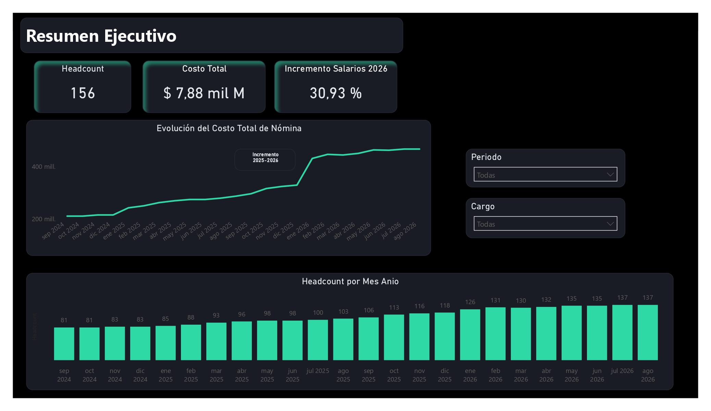
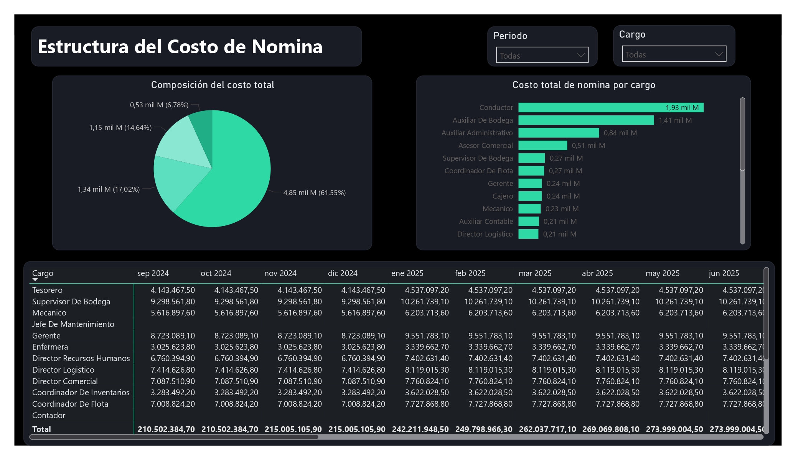
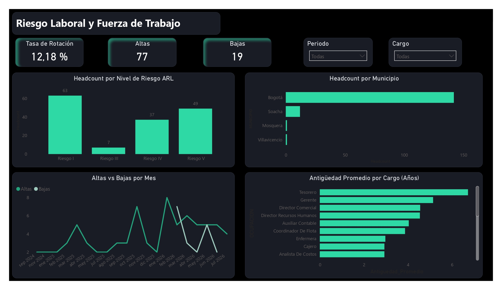

# Dashboard de Nómina y Costos de Personal — Empresa de Transporte y Logística

Dashboard de análisis de datos construido en Power BI para el seguimiento del costo de nómina, la composición del gasto de personal, el riesgo laboral (ARL) y la rotación de una empresa ficticia de transporte y logística en Colombia.

Este proyecto forma parte de mi portafolio como Especialista en Analítica Estratégica de Datos, combinando mi experiencia de más de 6 años en análisis financiero, contable y de nómina con herramientas de automatización (Python) y visualización de datos (Power BI).

---

## 🎯 Objetivo del proyecto

Simular y analizar el ciclo completo de costos de personal de una empresa colombiana: desde la liquidación individual de nómina (aportes a seguridad social y prestaciones sociales) hasta un dashboard ejecutivo que responde preguntas de negocio como:

- ¿Cómo evolucionó el costo total de nómina en los últimos 24 meses?
- ¿En qué se compone ese costo (salarios, aportes, prestaciones, auxilio de transporte)?
- ¿Qué cargos concentran el mayor gasto?
- ¿Qué proporción del personal está en cargos de alto riesgo ARL?
- ¿Cuál es la tasa de rotación y cómo se compara la antigüedad entre cargos?

---

## 🗂️ Sobre los datos

Los datos de empleados (nombres, cargos, salarios) son **completamente sintéticos** — no corresponden a una empresa real ni se derivan de ninguna base de datos real. Sin embargo, todos los **cálculos de nómina siguen la normativa laboral colombiana vigente**:

- Salario Mínimo Legal Vigente (SMLV) y Auxilio de Transporte histórico 2023-2026 (fuente: Decretos del Ministerio del Trabajo)
- Aportes a seguridad social: Salud (4% trabajador / 8,5% empleador), Pensión (4% trabajador / 12% empleador), ARL (según nivel de riesgo del cargo), Caja de Compensación Familiar (4% empleador)
- Provisión de prestaciones sociales: cesantías, intereses sobre cesantías (12% anual), prima de servicios, vacaciones

Los cargos se distribuyeron de forma realista para una empresa de transporte y logística (conductores, auxiliares de bodega, personal administrativo, coordinadores, directores y gerencia), con una escala salarial coherente: los cargos de auxiliar y analista devengan el SMLV, escalando hasta la gerencia en el techo salarial definido.

---

## 🛠️ Metodología

### 1. Preparación de la base (Excel)
Se partió de una base de datos ficticia con información genérica de empleados, a la que se le asignó ID de empleado, se generaron nombres aleatorios, se redistribuyeron los cargos genéricos en roles reales de transporte y logística, y se calculó un ejemplo documentado (con comentarios de celda) de cómo se liquida cada aporte y prestación social.

### 2. Generación del histórico de 24 meses (Python)
Con `pandas` y `openpyxl`, se construyó un pipeline que expande la base de 156 empleados a una tabla de hechos mensual (2.605 filas), aplicando:
- Altas y bajas según las fechas de ingreso y retiro definidas en la base (`FECHA_INGRESO` / `FECHA_RETIRO`)
- Escalamiento salarial proporcional al crecimiento histórico del SMLV (2024-2026)
- Recalculo mes a mes de todos los aportes y provisiones

Ver [`generar_historico_nomina.py`](./generar_historico_nomina.py).

### 3. Modelo de datos y medidas (Power BI)
- Modelo relacional con tabla de hechos (`Historico_Mensual`), dimensión de empleados (`Empleados`) y una tabla de calendario para *time intelligence*
- +15 medidas DAX: costo total, variación % mes a mes, composición del costo, headcount por riesgo ARL, tasa de rotación, antigüedad promedio
- Manejo explícito de casos como el Fondo de Solidaridad Pensional (aporte adicional para salarios superiores a 4 SMLV)

### 4. Diseño visual
Dashboard de 3 páginas con tema oscuro personalizado (paleta verde menta sobre fondo `#12141C`), diseñado para resaltar un hallazgo clave: el impacto del incremento anual del SMLV en el costo total de nómina.

---

## 📊 Estructura del dashboard

| Página | Contenido |
|---|---|
| **Resumen Ejecutivo** | KPIs generales, evolución del costo total (24 meses), headcount por mes, línea de referencia del incremento de enero-2026 |
| **Costos y Composición** | Composición del costo (dona), ranking de costo por cargo, matriz de costo por cargo x mes |
| **Riesgo Laboral y Fuerza de Trabajo** | Headcount por nivel de riesgo ARL, headcount por municipio, altas vs. bajas, tasa de rotación, antigüedad promedio por cargo |

### Resumen Ejecutivo


### Costos y Composición


### Riesgo Laboral y Fuerza de Trabajo


---

## 🔑 Hallazgos principales

- El costo total de nómina pasó de **$210,5M a $466,3M** en 24 meses (+121%), impulsado tanto por crecimiento de planta (81 → 137 empleados) como por incrementos normativos del salario mínimo.
- El salto más pronunciado ocurrió en **enero de 2026: +30,9%** en un solo mes, resultado directo del incremento del SMLV (23%) combinado con el auxilio de transporte (24,5%) y nuevas contrataciones.
- La composición del costo se mantiene relativamente estable: **61,5% salarios, 17,0% aportes a seguridad social, 14,6% prestaciones sociales, 6,8% auxilio de transporte.**
- **Conductores y auxiliares de bodega concentran el 45% del costo total de nómina** — coherente con el perfil operativo de una empresa de transporte.
- **54,7% del personal** está en cargos de riesgo ARL IV-V (bodega, conducción, mantenimiento).
- Tasa de rotación del **12,2%** en 24 meses.

---

## 💻 Herramientas y habilidades demostradas

- **Excel avanzado**: fórmulas, validación de datos, documentación de supuestos
- **Python (pandas, openpyxl)**: automatización de pipeline de datos, generación de series de tiempo con reglas de negocio
- **Power BI**: modelado de datos, DAX (time intelligence, medidas con `CALCULATE`/`ALL`/`SWITCH`), diseño de dashboards, temas personalizados
- **Dominio contable/nómina**: aplicación de normativa laboral colombiana real (Ley 100 de 1993, Ley 50 de 1990, CST)

---

## 📁 Contenido del repositorio

```
├── nomina_transporte_logistica.xlsx   # Base maestra de 156 empleados con fórmulas documentadas
├── generar_historico_nomina.py        # Script Python: genera el histórico de 24 meses
├── nomina_historica_24m.xlsx          # Tabla de hechos mensual (output del script)
├── dashboard_nomina.pbix              # Archivo de Power BI con el dashboard completo
├── tema_dark_teal.json                # Tema visual personalizado de Power BI
├── /capturas                          # Screenshots de las 3 páginas del dashboard
└── README.md
```

---

## 👤 Autora

**Natalia Lara Cárdenas**
Profesional en Finanzas | Especialista en Analítica Estratégica de Datos
Universidad Konrad Lorenz

[LinkedIn](https://www.linkedin.com/in/natalia-lara-cardenas/)

---

*Nota: los datos de empleados en este proyecto son sintéticos y se generaron exclusivamente con fines de portafolio. Ninguna información corresponde a una empresa real.*
